# Mermaid Validate

<p></p>

**Catch broken diagrams before they reach your README.**



A standalone skill for **Codex · Claude Code · Cursor**, backed by a portable Python CLI.
Independent community project; not affiliated with or endorsed by the provider.

## ✨ What it does

- Render real SVG with pinned Mermaid CLI 12.0.0, rather than guessing syntax.
- Validate every Mermaid fence in a Markdown file, including tilde fences, with source line numbers.
- Bound renderer execution with a timeout; get JSON results and useful exit codes for CI.

## 🚀 Install

Requires Node.js **22.20+** for the tested skills installer.

```sh
npx skills@1.7.1 add joeeeeey/mermaid-validate --agent codex claude-code cursor --yes
```

The implementation is initially delivered in a pull request. Until that PR is merged,
reviewers can install the branch with:

```sh
npx skills@1.7.1 add 'https://github.com/joeeeeey/mermaid-validate#feat/standalone-skill' --agent codex claude-code cursor --yes
```

Then ask your agent to use **mermaid-validate**. The standard SKILL.md and bundled CLI are the
portable interface; no dependency on another personal skill is needed.

## 🔎 Try it

From the installed skill directory, or a repository checkout:

```sh
python3 scripts/validate_mermaid.py --markdown examples/diagrams.md --json
```

No credentials. Python 3.10+, Node.js 22.20+ and npm. First rendering downloads pinned Mermaid CLI and a Puppeteer browser; a compatible Chrome runtime and OS libraries are required. Use `--mmdc /path/to/mmdc` for a preinstalled renderer.

Run `python3 scripts/validate_mermaid.py --help` for all commands.
Use a secret manager or a private local file for credentials; avoid pasting values into shell history.

## How to use it well

Read the diagram and preserve its intended meaning. Run the renderer, fix syntax failures, then re-render. Inspect layout separately: syntax success does not prove readability. Avoid rendering untrusted diagram content with browser sandboxing disabled.

## 🧪 Compatibility and verification

| Layer | Scope |
| --- | --- |
| Runtime | Python 3.10+; dependency-free standard library helpers |
| Agent interface | Standard SKILL.md + relative scripts; Codex, Claude Code, Cursor |
| Offline verification | Synthetic fixtures and mocks; run `python3 -m unittest discover -s tests -v` |
| Installation / native execution | See [validation evidence](references/validation.md) for exact tested levels |
| Live account operations | Not exercised as part of this release |

The illustration uses declarative SVG animation, with a readable static state and reduced-motion
fallback. It contains no JavaScript, external font or remote image dependencies.

## Limits and data handling

Renderer version may differ from GitHub's Mermaid version. Nested lists and blockquoted Markdown fences are not parsed. `--timeout` applies per diagram. JSON errors can include diagram text; review before sharing.

Secret-like fields and configured credential values are redacted where supported. Ordinary
resource names, logs and account metadata may still be private: review output before sharing.

[Official documentation and API notes](references/api.md) · [MIT license](LICENSE)

## Provenance

Extracted and maintained from the author's existing local skill implementation, with
account-specific defaults and private operational notes removed. Documentation, fixtures and
workflow SVG artwork in this distribution are original. Provider marks are attributed in
[brand sources](assets/BRAND-SOURCES.md) and excluded from the MIT license. External runtimes and provider services retain
their own licenses and terms; this repository does not redistribute them.
